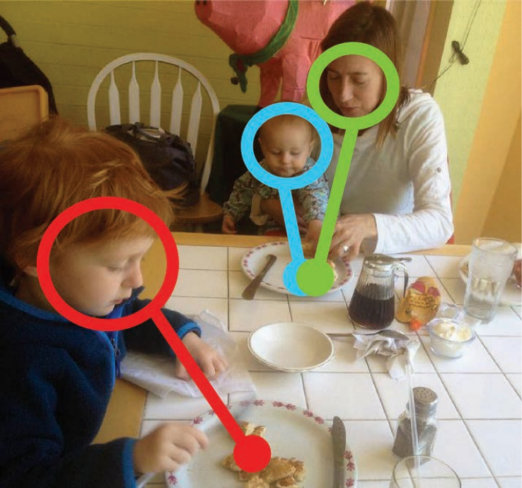
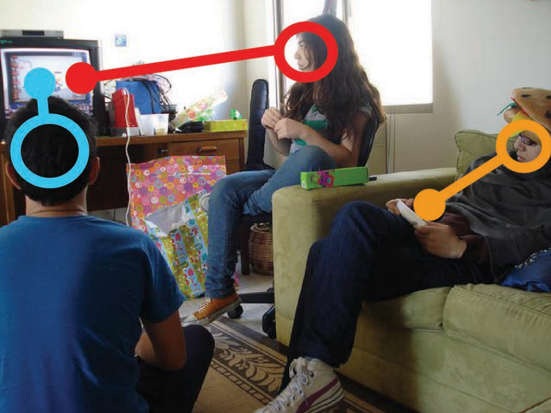
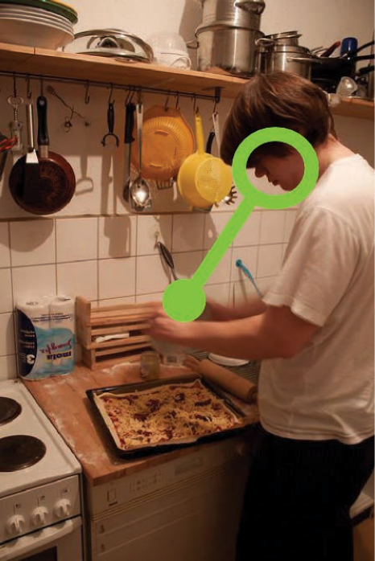
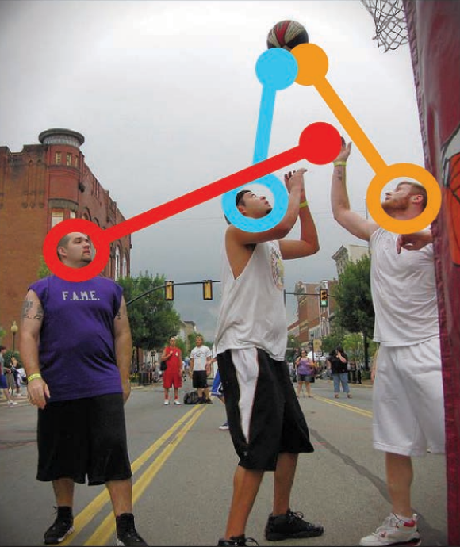
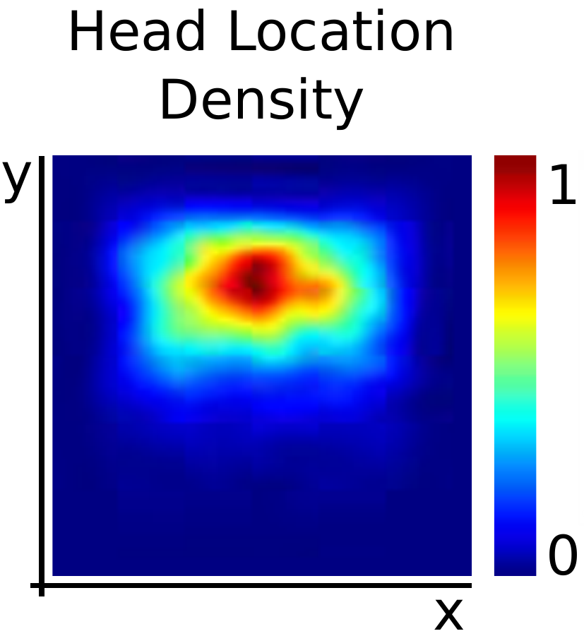
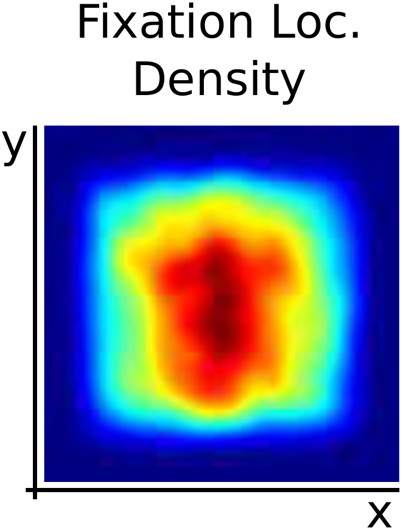
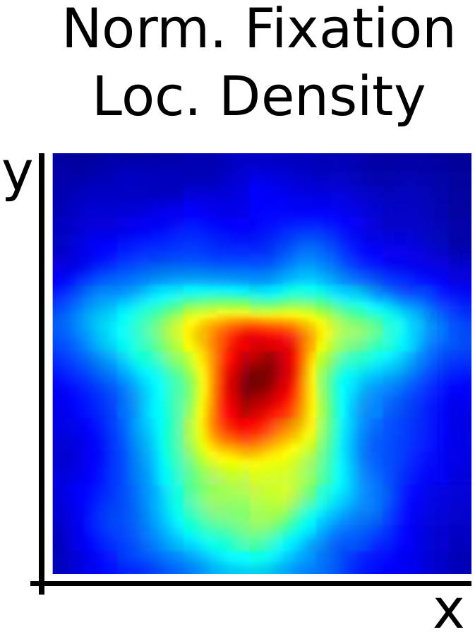
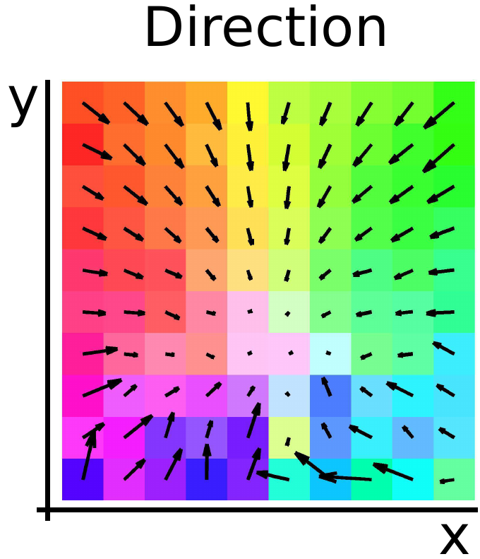
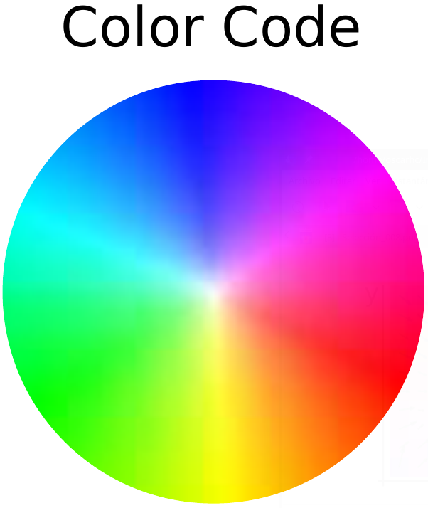

# Where are They looking?

## Resumen
Los humanos tienen la notable capacidad de seguir la mirada de otras personas, cuando conversas con alguien y observas algo destrás de él (ella) volteará por instinto.
Esta habilidad va de mano con la empatía, que nos permite asumir lo que otra persona esta pensando, como se siente o si va a realizar a alguna acción.

En el presente se expone la propuesta del paper
_[Where are they looking?](http://gazefollow.csail.mit.edu/)_ cuyo enfoque comprende el uso de redes neuronales profundas para el seguimiento de miradas con un nuevo conjunto de datos de referencia 'GazeFollow'

El enfoque consiste en tomar la posición de la cabeza en la imagen, para identifica el rango de visión y los objetos contenidos en dicho rango; y por medio de la red profunda concluir que se está observando. Este enfoque produce resultados confiables, incluso cuando solo se ve la parte posterior de la cabeza. Pero aún no se tiene el rendimiento humano en esta tarea.

---------------------------------------------

## Introducción ##
La habilidad de seguir con la mirada lo que otras personas están observando es
un punto clave para comprender lo que las personas están haciendo y cuales son
sus intenciones. Por tal motivo es crucial que un sistema de visión por
computadora tenga esta capacidad para comprender e interpretar mejor a las
personas.

<table>
  <tr>
    <td height="150"></td>
    <td height="150"></td>
    <td height="150"></td>
    <td height="150"></td>
  </tr>
  <tr>
    <td colspan="4"><b>Gaze-following:</b> Se presenta un modelo que predice el punto de observación y además un nuevo conjunto de datos a gran escala por gaze-following.</td>
  </tr>
</table>
Gaze-following tiene aplicaciones en robótica e interfaces de interacción humana, donde es importante comprender el objeto de interés de una persona.

Mediante el seguimiento de las miradas se puede predecir los objetos con los que planean interactuar incluso antes de comenzar una acción.

__Formulación:__ _Dada una imagen única que contiene una o más personas, la tarea es predecir la ubicación que está mirando cada persona en un escenario._

__Data:__ _Para entrenar y evaluar nuestro modelo, se presentamos GazeFollow, un conjunto de datos de referencia a gran escala para el seguimiento de la mirada._

__Entrada:__ _El escenario o imagen; la ubicación de la persona para la que queremos seguir la mirada._

__Funcionamiento:__ _Se trata de una arquitectura profunda que aprende a combinar la orientación de la cabeza y la ubicación de la cabeza en el escenario para  seguir la mirada de una persona dentro de la imagen._

__Salida:__ _Distribución sobre posibles ubicaciones que la persona seleccionada podría estar mirando. (gráficamente como un mapa de prominencia desde el punto de vista de la persona)_

### Trabajos Relacionados
- __Saliency:__

- __Gaze:__

---------------------------------------------

## Gaze Follow: Un Conjunto de Datos a Gran Escala
Con el objetivo de realizar este trabajo, se construyó GazeFollow, que es un basto conjunto de datos que incluye imágenes y objetivos visuales que contempla:

<table>
  <tr>
    <th><b>Conjunto de Datos</b></th>
    <th><b>Cantidad de Imágenes</b></th>
  </tr>
  <tr><td><a href="https://groups.csail.mit.edu/vision/SUN">SUN</a></td><td>
1548
</td></tr>
  <tr><td><a href="http://cocodataset.org/#home">MS COCO</a></td><td>
33790
</td></tr>
  <tr><td><a href="http://vision.stanford.edu/Datasets/40actions.html">Actions 40</a></td><td>
9135
</td></tr>
  <tr><td><a href="http://host.robots.ox.ac.uk/pascal/VOC/databases.html">PASCAL</a></td><td>
7791
</td></tr>
  <tr><td><a href="http://www.image-net.org">ImageNet</a></td><td>
508
</td></tr>
  <tr><td><a href="http://places.csail.mit.edu">MIT Places</a></td><td>
198097
</td></tr>
</table>

Cuya concatenación resultó en un desafiante conjunto de datos que incluye una inmensa colección de personas en diferentes tipos de escenarios.

__Un poco sobre los Datos__
> Este conjunto de datos no incluye la verdad sobre la tierra de la mirada de cada persona, así que fue añadido usando Mechanical Turk de Amazon ([AMT](https://www.mturk.com/mturk/welcome)); con el cual se marcaron manualmente los centros focales y el punto donde de observación. Lo que incluye detalles como si el punto de observación está fuera de la imagen o si la cabeza no era visible

> Para mejorar la data se incluye imágenes con el valor certero de visión con objetivo y se descarta casos deficientes obteniendo: _130339_ personas en _122143_ imágenes con punto focal incluido en la imagen.

__Preparación__

Se separó la data en train (117361) y test (4782); con la condición que cada persona en una imagen forme parte de la misma división.
Para evitar bias, las imágenes de prueba se distribuyeran uniformemente en toda la imagen.
Además, para evaluar la consistencia humana en el seguimiento de la mirada, recogimos 10 anotaciones de la mirada por persona para el conjunto de test.

<table>
  <tr></tr>
  <tr>
<b>GazeFollow Dataset:</b><i>Se contemplan las anotaciones del objetivo de la mirada para cierto grupo de imágenes</i>

  </tr>
</table>

<table>
  <tr>
    <th colspan="3">
Densidad de Probabilidad
</th>
    <th colspan="2">
Dirección Objetivo Promedio
</th>
  </tr>
  <tr>
    <td width="150"></td>
    <td width="150"></td>
    <td width="150"></td>
    <td width="150"></td>
    <td width="150"></td>
  </tr>
  <tr>
    <td>Densidad de probabilidad para la ubicación de la cabeza.</td>
    <td>Densidad de probabilidad para la ubicación de la fijación objetivo.</td>
    <td>Densidad de probabilidad para la fijación normalizada respecto a la posición de la cabeza.</td>
    <td>Densidad de dirección promedio de fijación objetivo según posición de la cabeza.</td>
    <td>Color de código de intensidad de fijación objetivo (centro punto más probable).</td>
  </tr>
</table>

---------------------------------------------

## Learning to Follow Gaze
Principalmente el modelo está inspirado en la tendencia de los humanos a seguir la mirada hacia objetos en particular. Cuando las personas desean saber donde un persona está viendo en un momento determinado, generalmente ven primero la cabeza y ojos para saber el campo de visión y luego analizar que objetos podrían ser los que esta persona este observando de acuerdo a su perspectiva.

### Gaze and Saliency Pathways
Suponiendo que tenemos una imagen en particular xi y una persona para la cual deseamos predecir su mirada. Parametrizamos a esta persona con una ubicación espacial cuantificada de la cabeza de la persona xp, un recortado, una imagen de primer plano de su cabeza xh. Lo que se busca es predecir la ubicación espacial de la fijación de la persona representado por ***y*** utilizando redes profundas.
EL diseño de la red esta basada principalmente en dos vías, la primera para la mirada(gaze) y la segunda para los rasgos sobresalientes(saliency). Para la primera vía solo se tiene acceso a la imagen de primer plano de la cabeza de la persona y su ubicación, y se produce un mapa espacial,$G({ x }_{ h },{ x }_{ p })$ de dimensiones D x D, la segunda vía(saliency) observa la imagen completa pero no la posición de la personay produce otro mapa espacial, $S({ x }_{ i })$, de las mismas dimensiones que el mapa anterior, luego se combinan las dos vías mediante un producto especial:  
$$\hat { y } =F(G({ x }_{ h },{ x }_{ p })⊗S({ x }_{ i }))$$
- __Saliency map:__
Para formar la vía saliency se usa una red convolucional en toda la imagen para producir una representación oculta de tamaño ***D x D x K***
- __Gaze mask:__
De forma similar, para el camino de la mirada usamos tambien una red convolucional pero en la imagen de la cabeza, luego se concatena su salida con la posición de la cabeza y se utiliza varias capas completamente conectadas y un sigmoide para predecir la mascara de mirada de dimensiones ***D x D***.
- __Pathway visualization:__
A continuación se mostrará imagenes que representan el mapa de saliency y la máscara de gaze aprendida por nuestra red la cual aprende una noción de saliencia que es relevante para la tarea de seguimiento de mirada. La primera imagen muestra la salida de la máscara de mirada para distintas posiciones de cabeza. En la segunda se muestra tres partes en una solo imagen, la primera parte es la imagen de entrada, la segunda parte es la saliencia de visualización libre estimada y la saliencia que sigue la mirada estimada usando nuestro modelo.

| __Gaze mask__    | __Saliency__     |
| :------------- | :------------- |
| | |
| | |
| |  |

### Multimodal Predictions
A pesar que los humanos casi siempre son capaces de seguir la mirada de una persona de manera confiable en algunas oportunidades esta puede ser ambigua, por ejemplo si hay muchos objetos salientes en la imagen o la dirección de la vista de la persona no es muy bien percibida entonces habrá este tipo de incertidumbre.

__Shifted grids:__
Para la clasificación, en primer lugar se debe elegir el número de celdas, ***N***. Pero la eleción de este parámetro es importante ya que si se eligiera un valor bajo de ***N*** tendríamos muy poca precisión en los resultados, en cambio si eligieramos una valor alto de ***N*** tendríamos más precisión pero el proceso de aprendizaje sería más difícil porque las perdidas de clasificación estandar no penalizarían adecuadamente las categorías espaciales.
### Training
La red end-to-end que utilizamos es creada usando backpropagation además se usó un ***softmax loss***(se define como la combinación de un ***cross-entropy loss***, una ***softmax function*** y la última capa completamente conectada) para cada ***shifted grid*** y promediar sus pérdidas. Además debido a que el modelo solo es supervisado con fijaciones de la mirada, no se considera que las vías de la mirada y la saliencia resuelvan sus respectivos subproblemas, mas bién se espera que la propia estructura de nuestro modelo resuelva automaticamente estos conflictos.

__Implementation details:__
Para la implementación del modelo se usó un framework de deep learning llamado ***Caffe***, las capas convolucionales en las dos vías, tanto de la de saliency como en la de gaze, están basadas en la arquitectura de las 5 primeras capas de la arquitectura de AlexNet.

<table>
    <tr>
      <td width="300"></td>
      <td width="100"></td>
    </tr>
    <tr>
      <td></td>
      <td></td>
    </tr>
    <tr>
      <td></td>
      <td></td>
    </tr>
    <tr>
      <td colspan="2">
<b>Resultados Cualitativos:</b> <i> Se pueden observar varias imágenes que son ejemplos de éxitos y errores del modelo, donde las lineas rojas corresponden a las miradas verdaderas y las lineas amarillas a las miradas pronosticadas.</i>
</td>
    </tr>
</table>

|     Modelo     | AUC   | Dist. | Dist. | Ángulo |
|:--------------:|-------|-------|-------|-------:|
| Nuestro        | 0.878 | 0.190 | 0.113 |  24°   |
| SVM+shift grid | 0.788 | 0.268 | 0.186 |  40°   |
| SVM+one grid   | 0.758 | 0.276 | 0.193 |  43°   |
| Judd           | 0.711 | 0.337 | 0.250 |  54°   |
| Fixed bias     | 0.674 | 0.306 | 0.219 |  48°   |
| Center         | 0.633 | 0.313 | 0.230 |  49°   |
| Random         | 0.504 | 0.484 | 0.391 |  69°   |
| One human      | 0.924 | 0.096 | 0.040 |  11°   |

<table>
    <tr>
      <td width="300"></td>
      <td width="100"></td>
    </tr>
    <tr>
      <td></td>
      <td></td>
    </tr>
    <tr>
      <td></td>
      <td></td>
    </tr>
    <tr>
      <td colspan="2">
<b>Resultados Cualitativos:</b> <i> Se pueden observar varias imágenes que son ejemplos de éxitos y errores del modelo, donde las lineas rojas corresponden a las miradas verdaderas y las lineas amarillas a las miradas pronosticadas.</i>
</td>
    </tr>
</table>

|     Modelo     | AUC   | Dist. | Dist. | Ángulo |
|:--------------:|-------|-------|-------|-------:|
| Nuestro        | 0.878 | 0.190 | 0.113 |  24°   |
| SVM+shift grid | 0.788 | 0.268 | 0.186 |  40°   |
| SVM+one grid   | 0.758 | 0.276 | 0.193 |  43°   |
| Judd           | 0.711 | 0.337 | 0.250 |  54°   |
| Fixed bias     | 0.674 | 0.306 | 0.219 |  48°   |
| Center         | 0.633 | 0.313 | 0.230 |  49°   |
| Random         | 0.504 | 0.484 | 0.391 |  69°   |
| One human      | 0.924 | 0.096 | 0.040 |  11°   |

|    Modelo   | AUC   | Dist. | Dist. | Ángulo |
|:-----------:|-------|-------|-------|-------:|
| No image    | 0.821 | 0.221 | 0.142 |  27°   |
| No position | 0.837 | 0.238 | 0.158 |  32°   |
| No head     | 0.822 | 0.264 | 0.179 |  41°   |
| No eltwise  | 0.876 | 0.193 | 0.117 |  25°   |
| 5x5 grid    | 0.839 | 0.245 | 0.164 |  36°   |
| 10x10 grid  | 0.873 | 0.218 | 0.138 |  30°   |
| L2 loss     | 0.768 | 0.245 | 0.169 |  34°   |
| Our full    | 0.878 | 0.190 | 0.113 |  24°   |

## Experiments
### Setup
### Resultados
### Análisis
__Ablation study:__
__Internal representation:__
__Automatic head detection:__

---------------------------------------------

## Conclusión

|    Modelo   | AUC   | Dist. | Dist. | Angulo |
|:-----------:|-------|-------|-------|:------:|
| No image    | 0.821 | 0.221 | 0.142 |   27°  |
| No position | 0.837 | 0.238 | 0.158 |   32°  |
| No head     | 0.822 | 0.264 | 0.179 |   41°  |
| No eltwise  | 0.876 | 0.193 | 0.117 |   25°  |
| 5x5 grid    | 0.839 | 0.245 | 0.164 |   36°  |
| 10x10 grid  | 0.873 | 0.218 | 0.138 |   30°  |
| L2 loss     | 0.768 | 0.245 | 0.169 |   34°  |
| Our full    | 0.878 | 0.190 | 0.113 |   24°  |

***Evaluación del modelo con algunos componentes bloqueados***
