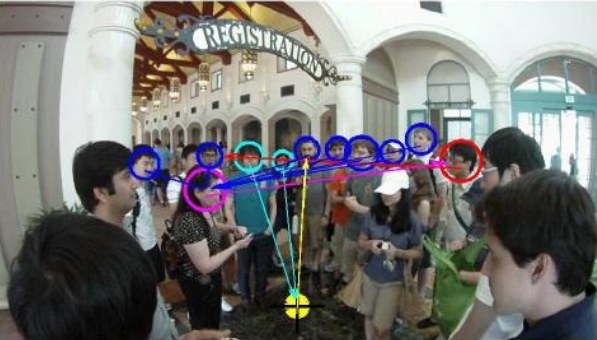
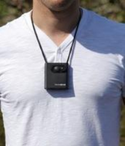
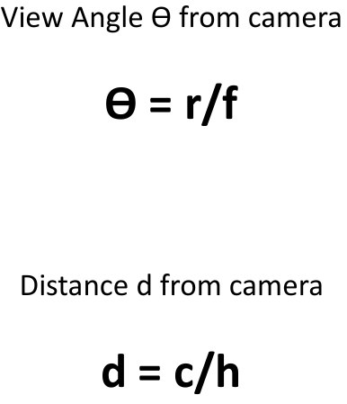
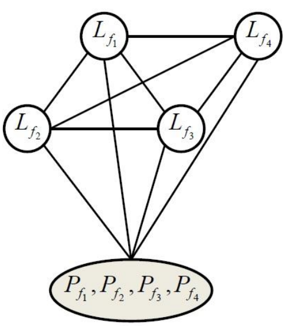
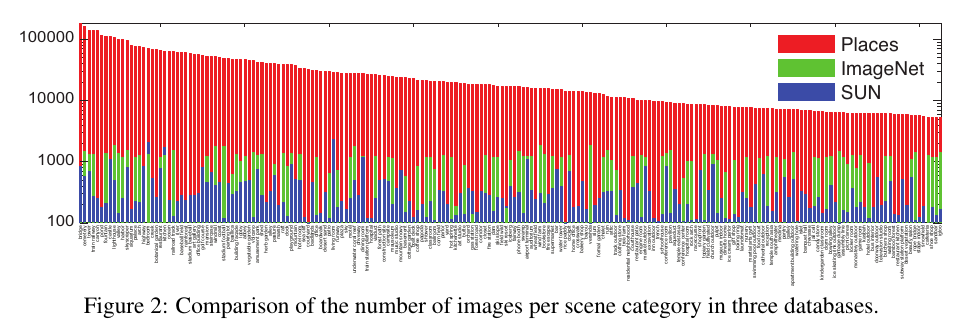
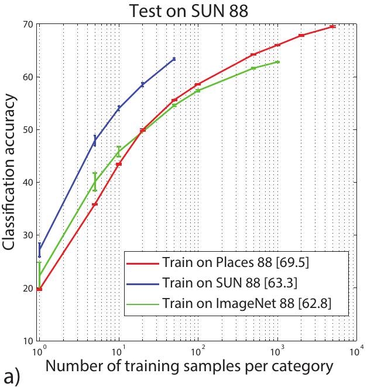
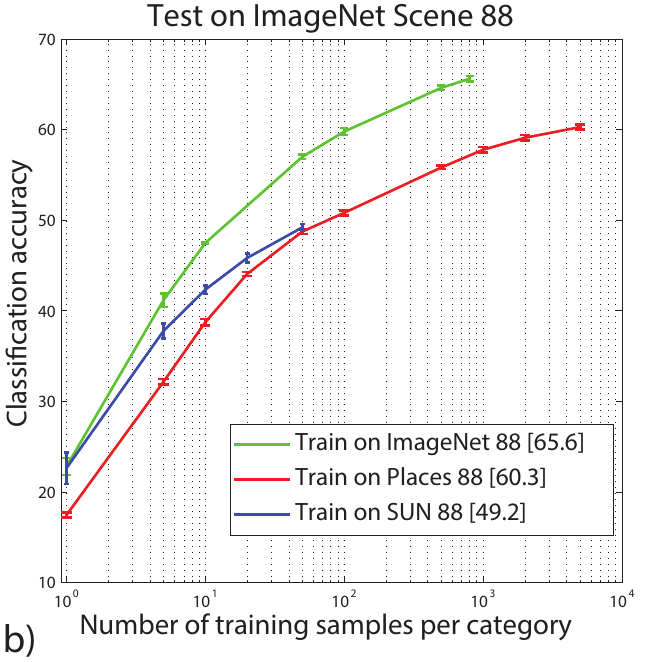
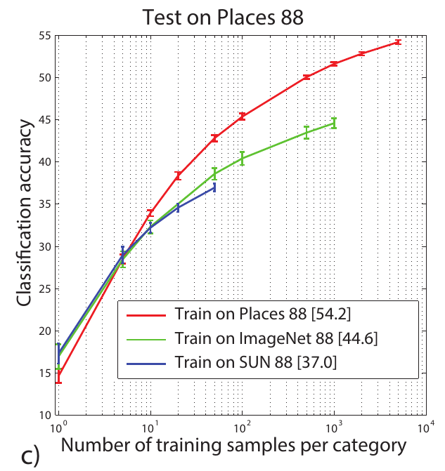

# Where are They looking?

## Resumen

En el presente se expone la propuesta del paper
_[Where are they looking?](http://gazefollow.csail.mit.edu/)_ cuyo enfoque comprende el uso de redes neuronales profundas para el seguimiento de miradas con un nuevo conjunto de datos de referencia 'GazeFollow'.

### Proceso:
* Tomar la posición de la cabeza en la imagen.
* Identificar el rango de visión y los objetos contenidos en dicho rango.
* Concluir que se está observando.

---------------------------------------------

## Introducción ##
<table>
  <tr>
    <td height="150"></td>
    <td height="150"></td>
    <td height="150"></td>
    <td height="150"></td>
  </tr>
  <tr>
    <td colspan="4"><b>Gaze-following</b></td>
  </tr>
</table>

### Aplicaciones Gaze following
* Robótica.
* Interfaces de interacción humana.
* Marqueting on retail.

__Formulación:__ _Dada una imagen única que contiene una o más personas, la tarea es predecir la ubicación que está mirando cada persona en un escenario._

__Data:__ _Para entrenar y evaluar nuestro modelo, se presentamos GazeFollow, un conjunto de datos de referencia a gran escala para el seguimiento de la mirada._

__Entrada:__ _El escenario o imagen; la ubicación de la persona para la que queremos seguir la mirada._

__Funcionamiento:__ _Se trata de una arquitectura profunda que aprende a combinar la orientación de la cabeza y la ubicación de la cabeza en el escenario para  seguir la mirada de una persona dentro de la imagen._

__Salida:__ _Distribución sobre posibles ubicaciones que la persona seleccionada podría estar mirando. (gráficamente como un mapa de prominencia desde el punto de vista de la persona)_

### Trabajos Relacionados

- __Saliency (Prominencia):__ Se tiende a observar la zona de fijación ocular, tendiendo a ver objetos dentro esta zona, ya que esta zona atraera la atención del observador.

- __Gaze (Mirada):__ Este modelo estima la dirección de la mirada sin poder identificar el objeto o persona que interactúa con nuestra persona observada. Usa un rastreador ocular basándose en las zonas de fijación que salen de la cabeza, sin embargo aún así no aborda el problema de la identificación del objeto.

<table>
  <tr>
    <th colspan="3">
Densidad de Probabilidad
</th>
    <th colspan="2">
Dirección Objetivo Promedio
</th>
  </tr>
  <tr>
    <td width="150"></td>
    <td width="150"></td>
    <td width="150"></td>
    <td width="150"></td>
    <td width="150"></td>
  </tr>
</table>

### Trabajos Previos
#### Social Interactions: A First-Person Perspective
<table>
  <tr>
    <th colspan="1">
Densidad de Probabilidad
</th>
    <th colspan="2">
Dirección Objetivo Promedio
</th>
  </tr>
  <tr>
    <td width="450" rowspan="3"></td>
    <td width="150" colspan="2"></td>
  </tr>
  <tr>
    <td width="150"></td>
    <td width="150"></td>
  </tr>
</table>

#### Learning Deep Features for Scene Recognition using Places Database

<table>
  <tr>
    
  </tr>
  <tr>
    <th></th>
    <th></th>
    <th></th>
  </tr>
</table>

<table>
  <tr>
    <th></th>
    <th>Places 205</th>
    <th>SUN 205</th>
  </tr>
  <tr>
    <td><b>Places-CNN</b></td>
    <td>50.0%</td>
    <td>66.2%</td>
  </tr>
  <tr>
  <td><b>ImageNet CNN feature+SVM</b></td>
  <td>40.8%</td>
  <td>49.6%</td>
  </tr>
</table>

## Gaze Follow: Un Conjunto de Datos a Gran Escala

<table>
  <tr>
    <th><b>Conjunto de Datos</b></th>
    <th><b>Cantidad de Imágenes</b></th>
  </tr>
  <tr><td><a href="https://groups.csail.mit.edu/vision/SUN">SUN</a></td><td>
1548
</td></tr>
  <tr><td><a href="http://cocodataset.org/#home">MS COCO</a></td><td>
33790
</td></tr>
  <tr><td><a href="http://vision.stanford.edu/Datasets/40actions.html">Actions 40</a></td><td>
9135
</td></tr>
  <tr><td><a href="http://host.robots.ox.ac.uk/pascal/VOC/databases.html">PASCAL</a></td><td>
7791
</td></tr>
  <tr><td><a href="http://www.image-net.org">ImageNet</a></td><td>
508
</td></tr>
  <tr><td><a href="http://places.csail.mit.edu">MIT Places</a></td><td>
198097
</td></tr>
</table>

Cuya concatenación resultó en un desafiante conjunto de datos que incluye una inmensa colección de personas en diferentes tipos de escenarios.

__Un poco sobre los Datos__
> Se trabajo con Mechanical Turk de Amazon ([AMT](https://www.mturk.com/mturk/welcome))

> Para mejorar la data se incluye imágenes con el valor certero de visión con objetivo y se descarta casos deficientes obteniendo: _130339_ personas en _122143_ imágenes con punto focal incluido en la imagen.

__Preparación__

Se separó la data en train (117361) y test (4782); con la condición que cada persona en una imagen forme parte de la misma división.

<table>
  <tr></tr>
  <tr>
<b>GazeFollow Dataset</b>

  </tr>
</table>

---------------------------------------------

## Learning to Follow Gaze
Principalmente el modelo está inspirado en la tendencia de los humanos a seguir la mirada hacia objetos en particular. Cuando las personas desean saber dónde una persona está viendo en un momento determinado, generalmente ven primero la cabeza y ojos para saber el campo de visión y luego analizar que objetos podrían ser los que esta persona este observando de acuerdo a su perspectiva.

### Gaze and Saliency Pathways
Si tenemos una imagen xi nuestro objetivo es la de predecir la mirada de la persona en nuestra imagen, entonces nuestra primera tarea es identificar a la persona dentro de la escena, parametrizándola y ubicando la cabeza en el espacio de la escena, de manera cuantificada en xp; Luego recortamos un primer plano de la cabeza en xh. Lo que se busca es predecir la ubicación espacial de la persona en la imagen xi.
La red fue diseñada basada en dos modelos, la primera basada en **gaze** y el segundo modelo está basado en **saliency**, el primer modelo tiene acceso a la ubicación (xp) y a la imagen cortada de la cabeza (xh), produciendo un mapa espacial G(xh,xp) de dimensiones D x D; El segundo modelo tiene acceso a la imagen completa sin mayores atributos, produciendo otro mapa espacial S(xi) de dimensión _D x D_, luego tenemos una salida de un producto especial

  <b>ŷ</b> = <b>F</b>( <b>G</b>(xh, xp) ⊗ <b>S</b>(xi ) )

Donde "⊗" representa el producto, *F()* corresponde a una capa totalmente conectada que utiliza el producto de los dos pathways para predecir hacia donde está mirando una persona(ŷ).

- __Saliency map:__
Para formar el saliency pathway se usa una red convolucional en toda la imagen para producir una representación oculta de tamaño *D x D x K*.
- __Gaze mask:__
De forma similar, para el camino de la mirada usamos también una red convolucional pero en la imagen de la cabeza, luego se concatena su salida con la posición de la cabeza y se utiliza varias capas completamente conectadas y un sigmoide para predecir la máscara de mirada de dimensiones *D x D*.
- __Pathway visualization:__
A continuación, se mostrará imágenes que representan el mapa de saliency y la máscara de gaze aprendida por nuestra red la cual aprende una noción de saliencia que es relevante para la tarea de seguimiento de mirada. La primera imagen muestra la salida de la máscara de mirada para distintas posiciones de cabeza. En la segunda se muestra tres partes en una solo imagen, la primera parte es la imagen de entrada, la segunda parte es la saliencia de visualización libre estimada y la saliencia que sigue la mirada estimada usando nuestro modelo.

| __Gaze mask__    | __Saliency__     |
| :------------- | :------------- |
| | |
| | |
| |  |

### Multimodal Predictions
los seres humanos tienen la capacidad de poder seguir la mirada de una persona, sin embargo, se existen casos de ambigüedad en algunas oportunidades, un ejemplo es tener una imagen con muchos objetos salientes o la dirección de la vista de la persona no es muy bien percibida generando un tipo de incertidumbre en el objetivo del seguimiento de la mirada. Una solución a esto es usar una rejilla sobre la imagen, teniendo como tare de la red una clasificación de las entradas, considerando salidas multimodales ya que cada categoría tiene un nivel de confianza al predecir el seguimiento de la mirada exacta.

__Shifted grids:__
Para la clasificación, en primer lugar, se debe elegir el número de celdas, *N* que define las dimensiones de la rejilla o cuadricula que se hará sobre la imagen para manejar los múltiples objetos salientes de la imagen. Pero la elección de este parámetro es importante ya que si se eligiera un valor bajo de *N* tendríamos muy poca precisión en los resultados, en cambio si eligiéramos un valor alto de *N* tendríamos más precisión, pero el proceso de aprendizaje sería más difícil porque las pérdidas de clasificación estándar no penalizarían adecuadamente las categorías espaciales.
### Training
La red end-to-end que utilizamos es creada usando backpropagation además se usó un ***softmax loss***(se define como la combinación de un ***cross-entropy loss***, una ***softmax function*** y la última capa completamente conectada) para cada ***shifted grid*** y promediar sus pérdidas. Además, debido a que el modelo solo es supervisado con fijaciones de la mirada, no se considera que las pathways de la mirada y la saliencia resuelvan sus respectivos subproblemas, mas bien se espera que la propia estructura de nuestro modelo resuelva automáticamente estos conflictos.

__Implementation details:__
Para la implementación del modelo se usó un framework de deep learning llamado ***Caffe***, las capas convolucionales en las dos pathways, tanto de la de saliency como en la de gaze, están basadas en la arquitectura de las 5 primeras capas de la arquitectura de AlexNet.

<table>
    <tr>
      <td width="300"></td>
      <td width="100"></td>
    </tr>
    <tr>
      <td></td>
      <td></td>
    </tr>
    <tr>
      <td></td>
      <td></td>
    </tr>
    <tr>
      <td colspan="2">
<b>Resultados Cualitativos:</b> <i> Se pueden observar varias imágenes que son ejemplos de éxitos y errores del modelo, donde las lineas rojas corresponden a las miradas verdaderas y las líneas amarillas a las miradas pronosticadas.</i>
</td>
    </tr>
</table>

|     Modelo     | AUC   | Dist. | Min. Dist. | Ángulo |
|:--------------:|-------|-------|-------|-------:|
| Nuestro        | 0.878 | 0.190 | 0.113 |  24°   |
| SVM+shift grid | 0.788 | 0.268 | 0.186 |  40°   |
| SVM+one grid   | 0.758 | 0.276 | 0.193 |  43°   |
| Judd           | 0.711 | 0.337 | 0.250 |  54°   |
| Fixed bias     | 0.674 | 0.306 | 0.219 |  48°   |
| Center         | 0.633 | 0.313 | 0.230 |  49°   |
| Random         | 0.504 | 0.484 | 0.391 |  69°   |
| One human      | 0.924 | 0.096 | 0.040 |  11°   |

***Evaluación del modelo en la forma base***

|    Modelo   | AUC   | Dist. | Min. Dist. | Angulo |
|:-----------:|-------|-------|-------|:------:|
| No image    | 0.821 | 0.221 | 0.142 |   27°  |
| No position | 0.837 | 0.238 | 0.158 |   32°  |
| No head     | 0.822 | 0.264 | 0.179 |   41°  |
| No eltwise  | 0.876 | 0.193 | 0.117 |   25°  |
| 5x5 grid    | 0.839 | 0.245 | 0.164 |   36°  |
| 10x10 grid  | 0.873 | 0.218 | 0.138 |   30°  |
| L2 loss     | 0.768 | 0.245 | 0.169 |   34°  |
| Our full    | 0.878 | 0.190 | 0.113 |   24°  |

***Evaluación del modelo con algunos componentes bloqueados***
